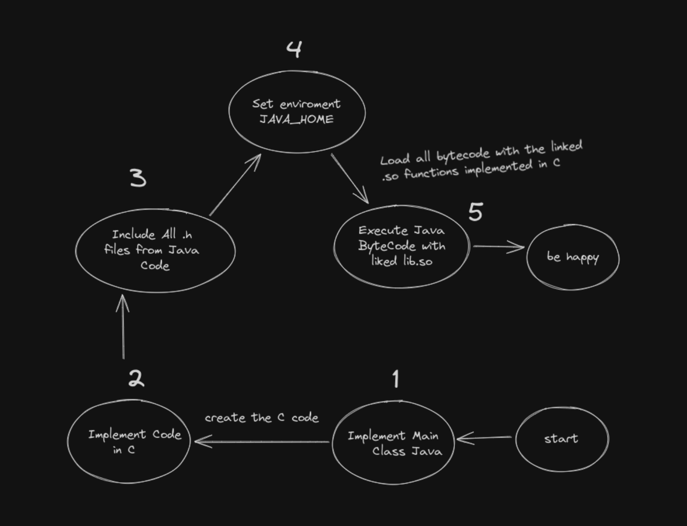

## Shared Objects Minimal Example 

## 🇧🇷 Português

**Este repositório contém um projeto para a integração e automação do processos de construção de código entre C e Java.**

- **Makefile:** Facilita a automação das etapas de build.
- **Integração JNI:** Permite a comunicação entre C e Java, demonstrando como criar e utilizar funções nativas em um ambiente Java.

## 🇬🇧 English

**This repository contains a project for integrating and automating build processes between C and Java**

- **Makefile:** Facilitates the automation of build steps.
- **JNI Integration:** Enables communication between C and Java, demonstrating how to create and use native functions in a Java environment.

### Ilustrate : 

### Version Limitation

**This project requires Java version 8 or higher.**

- **Supported Architectures:** Both 32-bit and 64-bit.
- **Note:** Ensure that you have the correct Java version installed and properly configured to build and run the project successfully.

